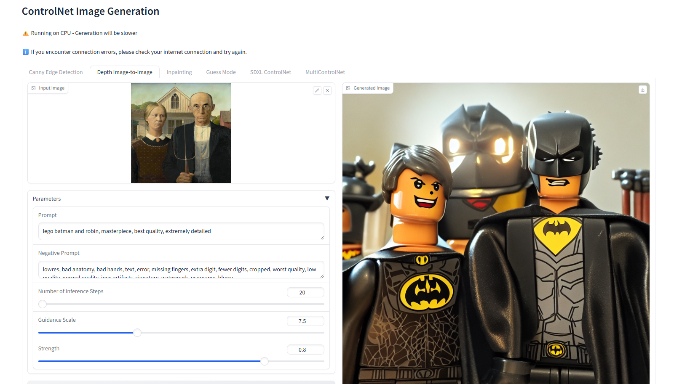

# ControlNet Image Generation App



A powerful image generation application built with Python and Gradio that leverages ControlNet for various image manipulation tasks.

## Features

- **Canny Edge Detection**: Generate images from edge-detected inputs
- **Depth Image-to-Image**: Transform images using depth maps
- **Inpainting**: Fill in masked areas of images with AI-generated content
- **Guess Mode**: Generate images without prompts using edge detection
- **SDXL ControlNet**: High-quality image generation using Stable Diffusion XL
- **MultiControlNet**: Combine pose detection and edge detection for enhanced control

## Requirements

- Python 3.9+
- PyTorch (CPU version)
- CUDA-compatible GPU (optional, for faster processing)

## Installation

1. Clone the repository:
```bash
git clone https://github.com/yourusername/ControlNet.git
cd ControlNet
```

2. Create a virtual environment and activate it:
```bash
python -m venv venv
source venv/bin/activate  # On Windows: venv\Scripts\activate
```

3. Install the required packages:
```bash
pip install -r requirements.txt
```

## Usage

Run the application:
```bash
python app.py
```

The app will be available at `http://localhost:7860` by default.

## Example Usage

1. **Canny Edge Detection**:
   - Upload an image
   - Adjust edge detection thresholds
   - Enter a prompt
   - Click "Generate Image"

2. **Depth Image-to-Image**:
   - Upload an image
   - Enter a prompt
   - Adjust strength and other parameters
   - Click "Generate Image"

3. **Inpainting**:
   - Upload an image and mask
   - Enter a prompt
   - Adjust parameters
   - Click "Generate Image"

4. **MultiControlNet**:
   - Upload an image
   - Adjust pose and edge detection parameters
   - Enter a prompt
   - Click "Generate Image"

## Notes

- The app runs on CPU by default, which may be slower than GPU processing
- Model downloads may take some time on first run
- Internet connection is required for model downloads

## License

MIT License

## Contributing

Contributions are welcome! Please feel free to submit a Pull Request. 